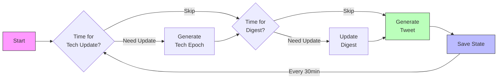

# Xavier's Story Generator (ACT II)
An AI-powered narrative system that chronicles Xavier's journey through social media posts from 2025 to 2075, continuing his story from ACT I (ages 18-22).

## Features
- **Continuous Generation**: Posts every 30 minutes, creating 1 year of story per 2 real-world days
- **Adaptive Storytelling**: Contextually aware content that builds on past events
- **Character Growth**: Evolving personality and relationships over five decades
- **Technological Integration**: Realistic progression of future technology
- **Dynamic Interactions**: Varied post types and engagement patterns

## Story Generation Workflow

The system consists of three main components that work together to create a coherent narrative:

### 1. Tweet Generator
- Main driver of the story progression
- Generates tweets every 30 minutes in real-time
- 2 real-world days ≈ 1 simulated year (96 tweets/year)
- Tracks story progression through tweet count and year
- Ensures tweets only reference currently available technology
- Coordinates updates to tech evolution and digest

### 2. Technology Evolution
- Generates in 5-year epochs (2025-2030, 2030-2035, etc.)
- Updates ~6 months (48 tweets) before next epoch begins
- Each epoch contains:
  - Mainstream technologies (fully adopted)
  - Emerging technologies (in development)
  - Epoch themes (societal trends)
- Maintains continuity by building on previous technologies

### 3. Story Digest
- Updates every ~12 tweets (about 6 hours real-time, 1.5 months simulated)
- Also updates when 3+ significant events occur
- Two main sections:
  - Story So Far (summarizes recent developments)
  - Story Direction (suggests future developments)
- Can look ahead to upcoming technology for story planning

### Generation Flow


### Key Interactions
- Tech Evolution informs both Tweet and Digest generation
- Digest uses current and upcoming tech to guide story
- Tweets only use currently available technology
- Each component maintains its own update cycle but works together for story coherence

## Project Structure
```
XaviersSimACTII/
├── data/                   # Story data
│   ├── XaviersSim.json         # ACT I tweet compilation
│   ├── digest.json             # Story digest
│   ├── last_acti_tweets.json   # Final ACT I tweets
│   ├── ongoing_tweets.json     # Current story threads
│   ├── comments.json           # Thread interactions
│   ├── simulation_state.json   # System state
│   └── tech_evolution.json     # Technology timeline
│
├── src/                    # Source code
│   ├── generation/             # Core generators
│   │   ├── tweet_generator.py      # Tweet creation
│   │   ├── digest_generator.py     # Story updates
│   │   └── tech_evolution_generator.py # Tech progression
│   │
│   ├── storage/               # Data management
│   │   ├── cleanup.py             # Data maintenance
│   │   └── github_operations.py   # GitHub integration
│   │
│   ├── twitter/               # Platform integration
│   │   ├── twitter_client.py      # API v1 client
│   │   └── twitter_client_v2.py   # API v2 client
│   │
│   └── utils/                 # Support functions
│       └── config.py              # Configuration
│
├── tests/                  # Test suite
│   └── test_github_operations.py
│
├── requirements.txt        # Dependencies
└── README.md              # Documentation
```

## Contributing
Feel free to open issues or submit pull requests for improvements to the story generation system.

## License
MIT License
