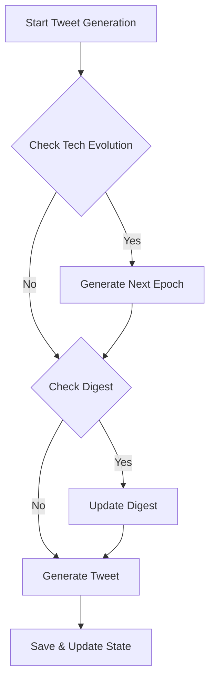

# Xavier's Story Generator (ACT II)

A narrative AI system that generates a continuous story through the lens of Xavier's social media posts, chronicling his journey from 2025 to 2075.

## Overview

This project uses AI to generate a coherent, long-form narrative through the medium of social media posts. It follows Xavier, a character navigating through five decades of life, technology, and personal growth, starting from 2025.

## Story Generation Workflow

The system consists of three main components that work together to create a coherent narrative:

### 1. Tweet Generator
- Main driver of the story progression
- Generates tweets every 30 minutes in real-time
- 2 real-world days ≈ 1 simulated year (96 tweets/year)
- Tracks story progression through tweet count and year
- Ensures tweets only reference currently available technology
- Coordinates updates to tech evolution and digest

### 2. Technology Evolution
- Generates in 5-year epochs (2025-2030, 2030-2035, etc.)
- Updates ~9 months (60 tweets) before next epoch begins
- Each epoch contains:
  - Mainstream technologies (fully adopted)
  - Emerging technologies (in development)
  - Epoch themes (societal trends)
- Maintains continuity by building on previous technologies

### 3. Story Digest
- Updates every ~12 tweets (about 6 hours real-time, 1.5 months simulated)
- Also updates when 3+ significant events occur
- Two main sections:
  - Story So Far (summarizes recent developments)
  - Story Direction (suggests future developments)
- Can look ahead to upcoming technology for story planning

### Generation Flow


### Key Interactions
- Tech Evolution informs both Tweet and Digest generation
- Digest uses current and upcoming tech to guide story
- Tweets only use currently available technology
- Each component maintains its own update cycle but works together for story coherence

## Features

- **Dynamic Story Generation**: Creates contextually aware posts that build upon previous events.
- **Timeline Management**: Tracks story progression from 2025 to 2075.
- **Character Development**: Maintains consistent character voice while allowing for growth and change.
- **State Management**: Preserves story continuity and character relationships.
- **Natural Variation**: Generates posts of varying lengths and tones, from quick updates to reflective essays.

## Project Structure

```
XaviersSimACTII/
├── data/                   # Data storage directory
│   ├── XaviersSim.json         # Compilation of existing tweets from XaviersSimACTI
│   ├── digest.json             # Up-to-date digest of story events and story planning
│   ├── last_acti_tweets.json   # Last ten tweets from XaviersSimACTI
│   ├── ongoing_tweets.json     # Active story threads
│   ├── comments.json           # Comments to active story threads
│   ├── simulation_state.json   # Current simulation state
│   └── tech_evolution.json     # Technology progression data
│
├── src/                    # Source code
│   ├── generation/             # Content generation modules
│   │   ├── tweet_generator.py      # Main tweet generation logic
│   │   ├── digest_generator.py     # Story digest generation
│   │   └── tech_evolution_generator.py # Tech timeline generator
│   │
│   ├── storage/               # Data persistence layer
│   │   ├── cleanup.py             # Data cleanup utilities
│   │   └── github_operations.py   # GitHub integration
│   │
│   ├── twitter/               # Twitter integration
│   │   ├── twitter_client.py      # Twitter API client
│   │   └── twitter_client_v2.py   # Twitter API v2 client
│   │
│   └── utils/                 # Utility functions
│       └── config.py              # Configuration management
│
├── tests/                  # Test suite
│   └── test_github_operations.py   # GitHub operations tests
│
├── requirements.txt        # Project dependencies
└── README.md               # Project documentation
```

### Key Components

#### Data Layer
- Storage for simulation state, tweets, and story progression.
- Maintains technology evolution timeline.
- Tracks ongoing narrative threads and digests.

#### Generation
- `tweet_generator.py`: Core story generation.
- `digest_generator.py`: Creates story summaries.
- `tech_evolution_generator.py`: Manages future tech progression.

#### Storage
- GitHub integration for data persistence.
- Cleanup utilities for maintaining data integrity.

#### Twitter Integration
- Multiple Twitter API client versions.
- Handles social media interaction.

#### Utils
- Configuration management.
- Helper functions.

## Contributing

Feel free to open issues or submit pull requests for improvements to the story generation system.

## License

MIT License
